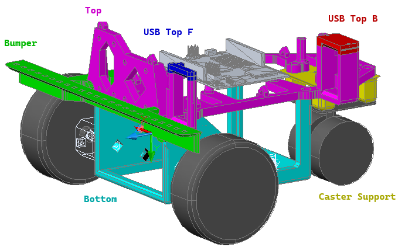
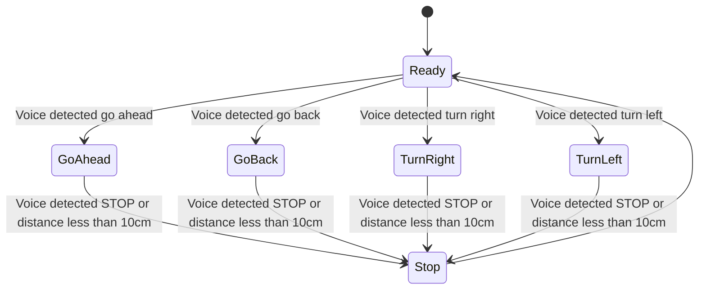

# SmoothSensors03

This is a simple robot that responds to these voice commands:

*  Go ahead
*  Go back
*  Turn right
*  Turn left
*  Stop
  
All its code is in this repository, including all files to 3D print its chassis.

[Here is a short video with it in action.](https://www.youtube.com/shorts/WzydsMxYGcc)

## Bill of materials

* Arduino Uno Q
* NASTIMA 6V 6Ah LiFePO4 Battery with USB C Charge
* Arduino Modulino Motors ABX00114
* Arduino Modulino Buttons ABX00110
* Arduino Modulino Distance ABX00102
* Arduino USB-C Hub (8 in 1) TPX00241
* DC Electric TT Prewired Gear Motor Wheel Kit 3-6V Dual Shaft Geared
* I2C Qwiic Cable Kit Stemma QT Wire
* USB Camera Module 640x480 30FPS Wide Angle 170° HD Vision Module for Robot Building DIY Webcam Board for Arduino
* M2, M2.5 and M3 bolts.
* Caster whell, 50mm tall.

## Software

* [Arduino CLI](https://github.com/arduino/arduino-cli/releases)
* [Arduino App Lab](https://docs.arduino.cc/software/app-lab/)
* [VS Code](https://code.visualstudio.com/download)


## The chassis

Folder `cad` has the 3D model and the 3D print files for the chassis that accommodates all parts.



The chassis was optimized to use as little material and to print as fast as possible. As such, it is composed of five parts:

| Part           | Part File | Description  |
|----------------|-----------|--------------|
| Top            | RobotChassis03Top.stl           | where the Arduino and the sensors are attached. |
| Bottom         | RobotChassis03Bottom.stl        | where the battery and the motors are attached. |
| UsbB           | RobotChassis03UsbB.stl          | The top of the USB hub harness, back part. |
| UsbF           | RobotChassis03UsbF.stl          | The top of the USB hub harness, front part. |
| Caster Support | RobotChassis03CasterSupport.stl | to be attached to the Top, then the caster wheel will be attached to. |
| Bumper         | RobotChassis03Bumper.stl        | (optional) a simple, sturdy bumper in the front, to be attached to the Top and Bottom. |

* File [RobotChassis03Split.dwg](cad/RobotChassis03Split.dwg) is the 3D model, it was done in AutoCAD.
* File [RobotChassis03.3mf](cad/RobotChassis03.3mf) is the Creality print file for all the parts in one print.

## If you are using WSL (Windows System for Linux)

WSL runs in a VM without full access to the network.

As such, there is one Arduino CLI command that does not work on WSL: 

```bash
arduino-cli board list
```

If you are in Windows using WSL, you will need to run that command in a Powershell/cmd prompt.

## How to deploy

1. First, you need to initialize the Arduino board. Make sure you followed the [Initial Setup instructions](https://docs.arduino.cc/software/app-lab/setup/overview) for [Single Board Computer](https://docs.arduino.cc/software/app-lab/setup/standalone) mode.
1. After your Arduino Q is connected to your network, you will always use it through the network, the provided deploy scripts assume the board is already network bound.
1. About the board's IP address:
   1. If you are using Windows with Powershell, you can use `scripts/deploy.ps1`, it automatically detect the board's IP address.
   1. Otherwise, you will need to discover the board's IP address and configure `scripts/deploy.sh` to point to the address:
      1. If you are using WSL, open a Powershell command prompt, if you are on Linux or Mac, open a command prompt.
      1. Run:
         ```
         arduino-cli board list
         ```
      1. If your robot is on and connected to the same network as your computer, you will see an output similar to this:
         ```
         Port       Protocol Type              Board Name    FQBN                Core
         10.0.0.221 network  Network Port      Arduino UNO Q arduino:zephyr:unoq arduino:zephyr
         ```
      1. The four numbers under `Port` are the IP address from your robot.
      1. Edit `scripts/deploy.sh` and replace the IP in this line with your robot's IP address:
         ```
         BOARD_IP="${1:-${BOARD_IP:-10.0.0.195}}"
         ```
      1. Save and close `scripts/deploy.sh`.
4. Now you can deploy the application:
   1. On Windows:
      1. Open a Powershell command prompt, 
      1. Go to the folder where you cloned this repository,
      1. Execute:
         ```powershell
         ./scripts/deploy.ps1
         ```
   1. On Linux/Mac/WSL
      1. Open a Powershell command prompt, 
      1. Go to the folder where you cloned this repository,
      1. Execute:
         ```bash
         ./scripts/deploy.sh
         ```

## Basic Functionality




## Known issues

1. (Arduino default behavior) the application must be redeployed every time the board is restarted.
2. When the robot is moving, due to the noise of the motor, the voice commands are not well understood. You need to talk much louder or close to the mic, depending on the quality of the microphone you are using.
3. After the robot detects it is in less than 10 centimeters of some obstacle, it does not move. You say `robot go ahead` and it will move for half a second, at the most. In that case, place your hand in front of the distance sensor and move away. 
4. At this moment, `robot go back` seems to turn the robot.
5. I am using very low quality motors, so some motors move faster than others despite being fed the same tension and current. I recommend you buy many motors, then test them and get motors with similar RPM when fed 5V.


